# 로드셀 센서를 활용한 스마트 재고관리 시스템 구축(Inventory Watcher)

(feat. Spring Framework, Arduino, CAN, Latte Panda, Hadoop, R Programming, Oracle DB, TCP/IP, FCM,  AWS) 

###
###
###

### 팀 소개
- 팀명: TOP (**T**eam **O**verflowed with **P**assion)

  - 열정이 넘쳐 흐르는 팀

- 팀원 및 역할:
  - 조현민 **(팀장)**

    - 프로젝트 통합, 프로젝트 일정 관리, ERD 작성, Oracle DB 구축, AWS DB 및 웹서버 구축, 데이터 분석 및 시각화, Spring Framework 설계 및 구축, SQL 쿼리 스크립트 작성, Git을 통한 프로젝트 형상관리, 프로젝트 서비스 로직 구현

  - 윤동현 **(부팀장)**

    - 프로젝트 기획, 디자인 담당, 회의록, WBS 작성, 발표자료 및 패널 작성, 웹 및 앱 화면 설계, POS 안드로이드앱 개발, 로컬 안드로이드앱 개발, AWS 서버 환경 구축, IoT센서 하드웨어 제작

  - 최희은

    - 웹서비스 회원가입 기능, 웹서비스 관리자 기능, 웹서비스 CRUD 기능, 웹 메세지 전송 기능, 로그데이터 수집

  - 강현수

    - 센서 하드웨어 제작, Logistics 앱 제작, 재료 등록 기능 구현, FCM 서비스 구현, 시나리오 동영상 제작, CAN 통신 구축

  - 장민재

    - 발주 웹기능, 하둡 환경 담당, 하둡 하이브 쿼리 작성

    

- 훈련과정명: 빅데이터를 활용한 IoT 시스템 개발(feat. 스마트시티 프로젝트)

- 운영기관: 멀티캠퍼스 역삼
  
###
###
###

### 프로젝트 소개

1. **프로젝트 주제** 
	
	- 로드셀 센서를 활용한 스마트 재고관리 시스템
	
	
	
2. **프로젝트 배경**

  - 브레인스토밍 중 팀원들과 다양한 아르바이트 경험을 바탕으로,
  - **매장 재고관리**와 **[AWS IoT Button](https://aws.amazon.com/ko/iotbutton/)** 과 같은 아이디어를 결합하여 특정 상품뿐만이 아닌 다양한 상품 및 재료의 물량 상태를 확인하고 부족한 경우에 경고할 수 있는 IoT 기기와 웹 & 앱 서비스를 구축하기로 하였습니다.

  

3. **프로젝트 기술 목적**

  - <u>*"스마트하게 재고를 관리할 수 있는 시스템"*</u>
    - 자체 제작한 하드웨어를 통해 재료의 물량 상태를 실시간으로 확인할 수 있는 앱 개발
    - 부족한 재료가 자동으로 발주 주문서에 쌓이는 시스템을 구축
    - 재료가 유통기한에 다가오는 경우 & 재료가 부족한 경우에 알림 서비스 구현
    - 배송상태 확인 서비스 구현
  - *<u>"특정 주체를 선정하여 서비스를 구체화함"</u>*
    - 본사와 가맹점이 존재한다는 가정하에 구현해야할 서비스를 구체화
    - 이러한 가정을 결정한 이유는 모든 가맹점이 사용하는 재료가 동일할 것이므로 저희가 개발함에 있어 비지니스 로직을 간단화할 수 있을 것이라 생각했기 때문
  - *<u>"재고 비용 데이터와 매출 데이터를 쌓아 통계분석을 통한 재고관리 솔루션 제공"</u>*
    - 통계분석을 통해 재고 비용 대비 매출의 상관관계와 추천 재고량을 제공하는 솔루션을 개발하고자 함
  - <u>*"부트스트랩 UI를 통해 편리한 웹 & 앱 구축"*</u>
    - 부트스트랩 UI를 통해 브라우져 뿐만이 아니라 모바일 앱에서도 각종 알림, 재고 & 매출 상태, 분석 결과를 확인할 수 있도록 함
  - <u>*"하둡 대용량 파일 시스템을 이용하여 다량의 데이터 축적 및 다양한 데이터 분석에 활용"*</u>
    - 재고 비용, 일일매출, 메뉴별 일일판매량, 재고 주문 날짜 등 다양한 데이터를 하둡 분산 파일 시스템에 축적하고,
    - 이를 활용한 비지니스 솔루션을 제시
  - <u>*"AWS 서버에 웹서버 및 DB 서버를 구축하여 언제 어디에서든 프로젝트 시연 가능"*</u>
    - 로컬 네트워크에서뿐만이 아니라 누구든 저희 프로젝트를 테스트해 볼 수 있도록 AWS 서버에 구축

  

  
  
###
###
###
  

4. **서비스로직 설명**

  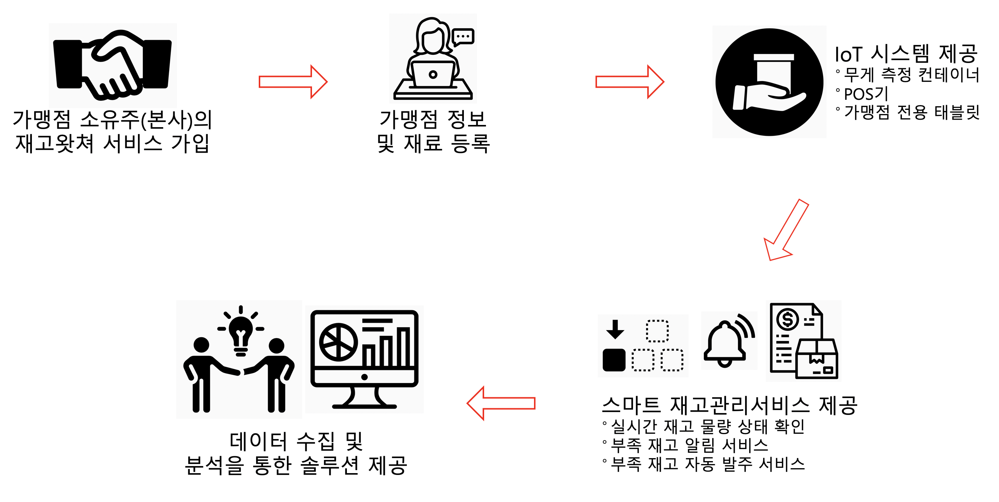

  
  

###
###
###
    

    

5. **개발환경 및 적용기술**

  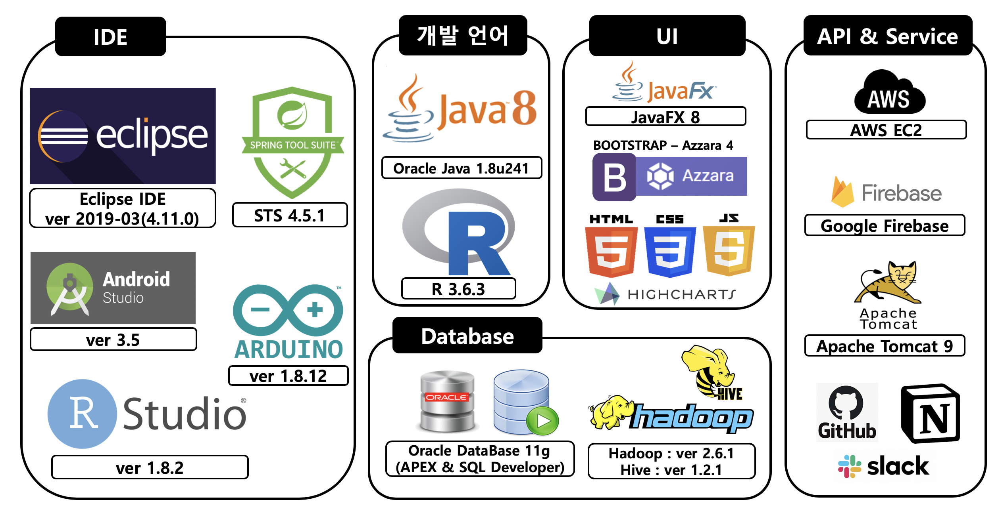

| IDE                                                          | 개발 언어                                            | UI                                                           |
| ------------------------------------------------------------ | ---------------------------------------------------- | ------------------------------------------------------------ |
| - Eclipse IDE ver 2019-03(4.11.0)  - Spring Tool Suite ver 4.5.1  - Android Studio ver 3.5  - R Studio ver 1.8.2  - Arduino ver 1.8.12 | - Oracle Java 1.8.u241  - R prgramming ver 3.6.3 | - JavaFx ver 8  - Boostrap 4 - Azzara 4  - HTML5  - CSS3.0  - JavaScript  - Highcharts |

| 데이터베이스                                                 | API & Service                                              | 프로젝트 관리                         | 하드웨어                                                     |
| ------------------------------------------------------------ | ---------------------------------------------------------- | ------------------------------------- | :----------------------------------------------------------- |
| - Oracle DB 11g    (APEX & SQL Developer)  - Hadoop ver 2.6.1 - Hive ver 1.2.1 | - AWS EC2   - Google Firebase  - Apache Tomcat 9 | - Github  - Slack  - Notion | - LattePanda  - Arduino Uno  - LoadCell Weight Detection Sensors  - CanPro |

  
  

###
###
###
  

  

6. **시스템 아키텍쳐**

  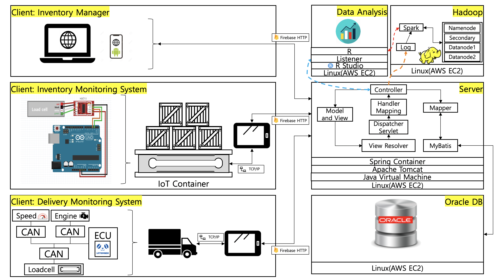

  

  
  

###
###
###
  

  

7. **ERD 설계**

  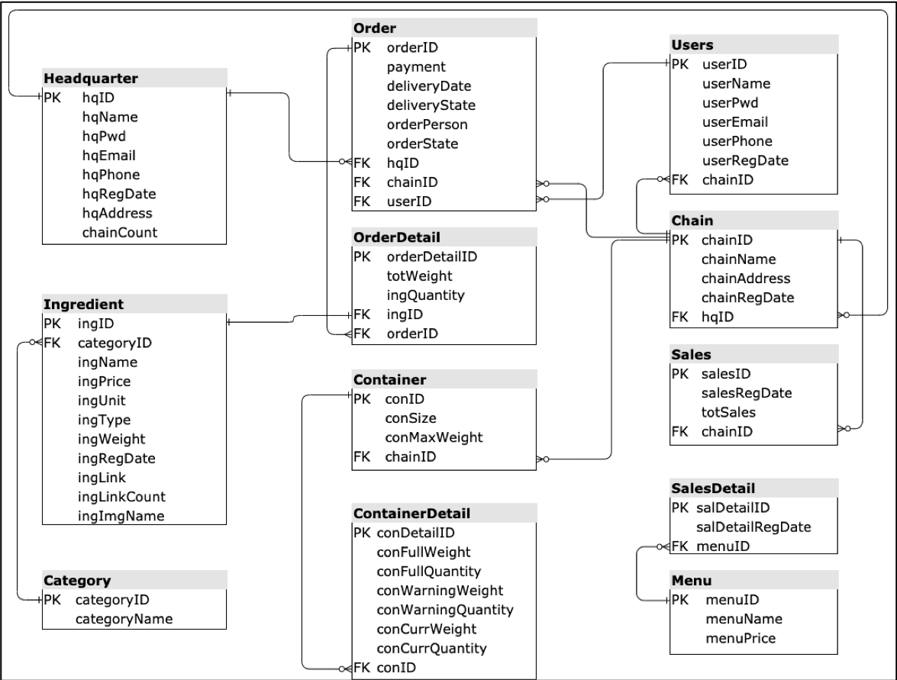

  

  
  

###
###
###
  

  

8. **프로젝트 결과물**

    1. 자체 제작한 무게 감지 하드웨서 "IoT 컨테이너"

       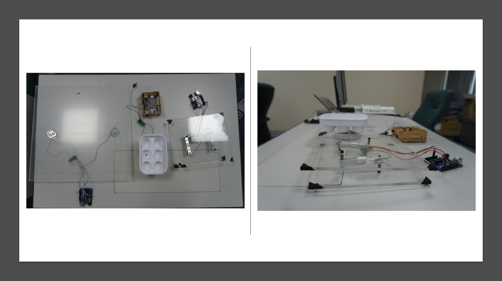

       

    2. 관리자 웹 페이지

       - 메인페이지

        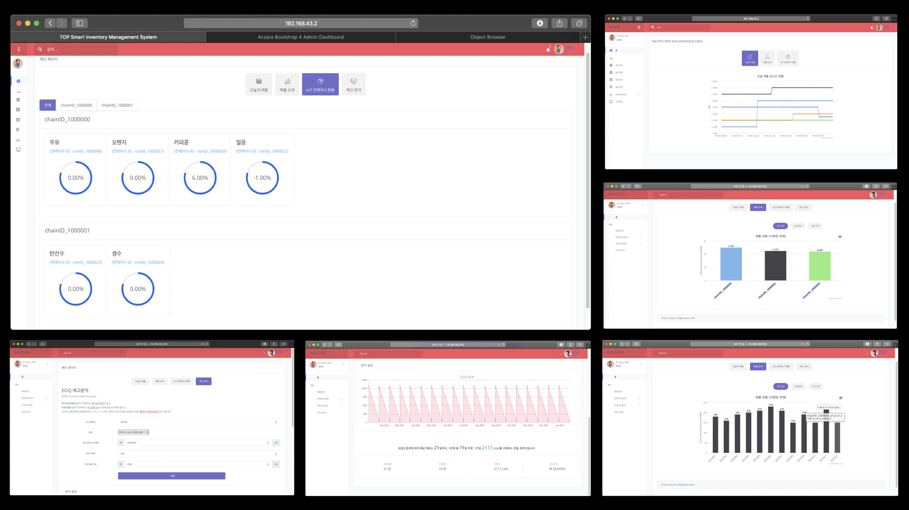

       

       - IoT 컨테이너 관리 페이지

        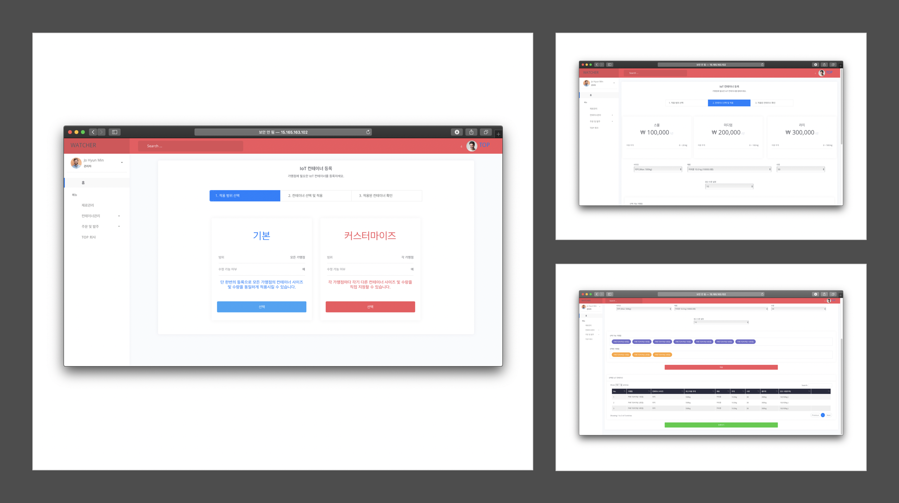

       

       - 재료 관리 페이지

         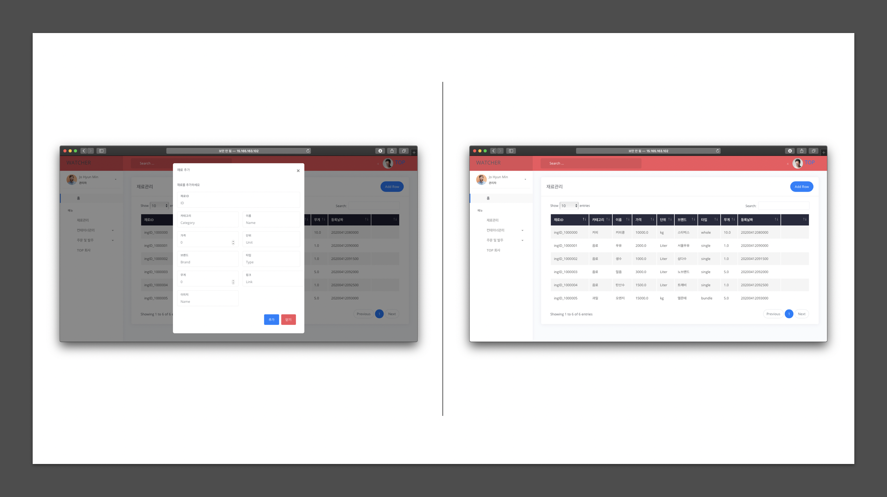

       

       - 주문 발주 페이지

        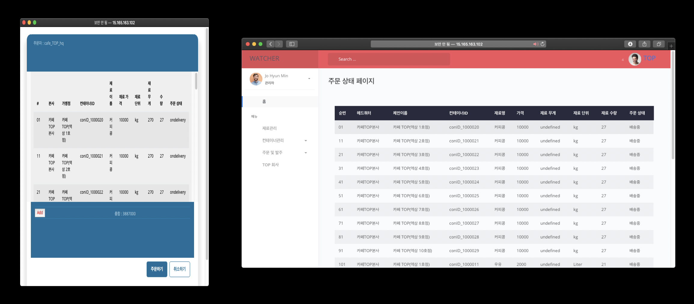

       

       

    3. 관리자 모바일 앱 화면

       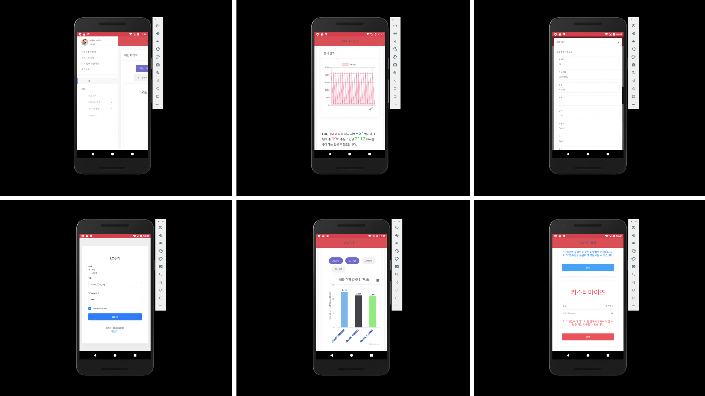

       

    4. 가맹점 태블릿

       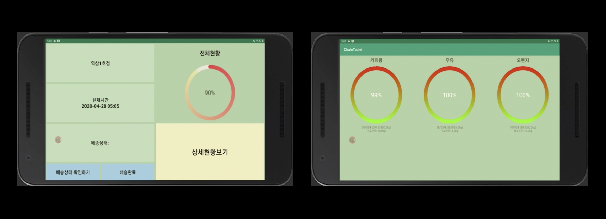

       

    5. POS기

       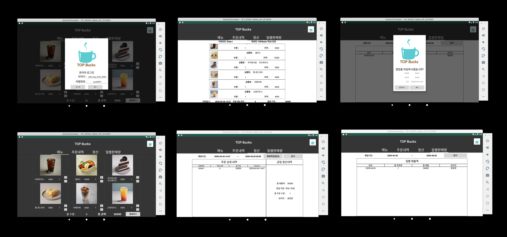

       

    6. 운반트럭 태블릿

       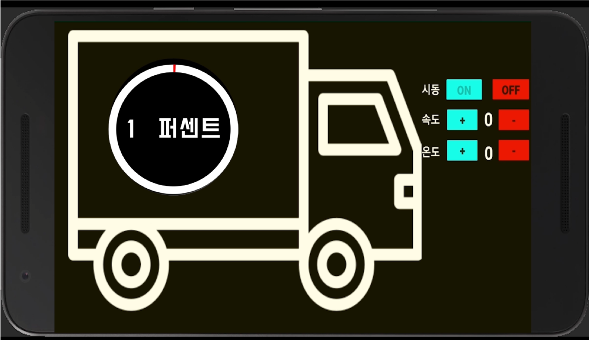

    
###
###
###

  

  ### 마치며..

  소중한 시간을 내어 저희의 프로젝트를 살펴봐주셔서 감사합니다.

  프로젝트 시연을 원하시거나 저의 대해 알고싶으신 분들께서는 아래의 링크를 클릭해 주시기 바랍니다.

  

  [관리자 웹사이트 직접 테스트 해보기](http://15.165.163.102/top)

  [프로젝트 시연 영상 보기](https://youtu.be/6x_5fEjYh4E)

  [JHM9191의 다른 프로젝트 및 이력서 보기](https://www.notion.so/jhm9191/Jo-Hyun-Min-7c46d52d463e4265af412494e6d1261f)

  